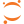

# Hi, I'm Licheng Zong 👋

<!--
**lczong/lczong** is a ✨ _special_ ✨ repository because its `README.md` (this file) appears on your GitHub profile.

Here are some ideas to get you started:

- 🔭 I’m currently working on ...
- 🌱 I’m currently learning ...
- 👯 I’m looking to collaborate on ...
- 🤔 I’m looking for help with ...
- 💬 Ask me about ...
- 📫 How to reach me: ...
- 😄 Pronouns: ...
- ⚡ Fun fact: ...
-->

* 🔭 I'm a senior student majoring in Electronics and Information @ Xi'an Jiaotong University.
* 🌱 I’m currently working on **CHENG**.
* -**C**-:  **C**omputational Biology
* -**H**-:  **H**ealthcare Analytics
* -**E**-:  **E**fficient Computing
* -**N**-:  **N**atural Language Processing
* -**G**-:  **G**PU Acceleration

## ⚡ Technologies
<!--

-->

  
  <code></code>
  <code></code>
  <code></code>
  <code></code>
  <code></code>
  <code></code>
  <code></code>
  <code></code>
  <code></code>
  <code></code>

  <code></code>
  <code></code>
  <code></code>
  <code></code>
  <code></code>
  <code></code>
  <code></code>
  <code></code>
  <code></code>

  
  <code></code>
  <code></code>
  <code></code>
  <code></code>
  <code></code>
   
  <code></code>
  <code></code>
  <code></code>
  <code></code>
  <code></code>
   
  <code></code>
  <code></code>
  <code></code>
  <code></code>
  <code></code>

## 🚩 Github Status

## 🌎 Find me

